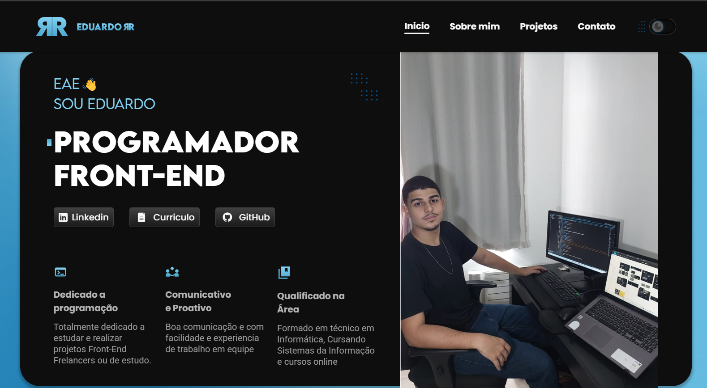
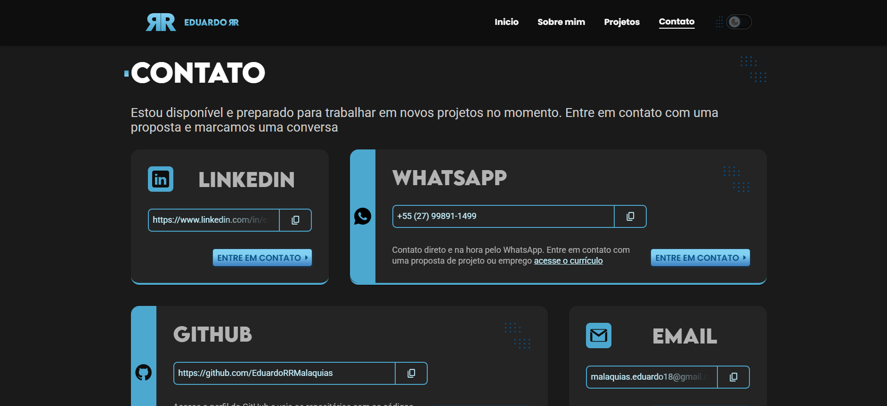

# Portifolio de Programador Front-End🖥️

Portifolio que apresenta os projetos, serviços e experiencias do programador e Ui Designer Junior, Eduardo Rodrigues Rangel Malaquias. Desenvolvido com as tecnologias Html, Css e JavaScript funcionalidades que exploram ao maximo o potencial de dinamicidade e estilização dessas tecnologias.

Confira no portifolio tambem projetos ultilizando tecnologias mais avançadas e atuais como Next.js, React, Vue entre outras

## 📲 Acesse e Veja!

ACESSE: https://eduardorrmalaquias.github.io/projeto_portifolio/

## Funcionalidades

- Temas claro e escuro
  Foi desenvolvido no projeto, com linguagem JavaScript e css ultilitario a funcionalidade do usuario escolher o tema de cor entre o claro e o escuro.

Ultilizado Variaveis e classes Ultilitarias:

    /* declaracoes e variaveis */

    @media (prefers-color-scheme: dark) {
    :root {
        /* cores Base */
        --cor-11: #000000;
        --cor-10: #0e0e0e;
        --cor-09: #1a1a1a;
        --cor-08: #242424;
        --cor-07: #404040;
        --cor-06: #595959;
        --cor-05: #9c9c9c;
        --cor-04: #b3b3b3;
        --cor-03: #cccccc;
        --cor-02: #ededed;
        --cor-01: #f7f7f7;
        --cor-00: #ffffff;
        /* cores Primarias */
        --cor-p7: #075187;
        --cor-p6: #1064a1;
        --cor-p5: #207fb4;
        --cor-p4: #4ca8cf;
        --cor-p3: #64b9de;
        --cor-p2: #82d1f2;
        --cor-p1: #c5f1ff;
        /* gradientes */
        --gradiente-primario: #82d1f2, #4ca8cf;
        --gradiente-primario2: #4ca8cf, #82d1f2;
        --gradiente-primario-light: #1064a1, #4ca8cf;
        --gradiente-secundario: #82d1f2 35%, #488bc9 90%;
        --gradiente-neutro: #404040, #1a1a1a;
        --gradiente-neutro-light: #f7f7f7, #cccccc;
    }
    }

    @media (prefers-color-scheme: light) {
    :root {
        /* cores Base */
        --cor-11: #ffffff;
        --cor-10: #f7f7f7;
        --cor-09: #ededed;
        --cor-08: #cccccc;
        --cor-07: #b3b3b3;
        --cor-06: #9c9c9c;
        --cor-05: #595959;
        --cor-04: #404040;
        --cor-03: #242424;
        --cor-02: #1a1a1a;
        --cor-01: #0e0e0e;
        --cor-00: #000000;
        /* cores Primarias */
        --cor-p7: #075187;
        --cor-p6: #82d1f2;
        --cor-p5: #4ca8cf;
        --cor-p4: #207fb4;
        --cor-p3: #64b9de;
        --cor-p2: #1064a1;
        --cor-p1: #1064a1;
        /* gradientes */
        --gradiente-primario: #1064a1, #4ca8cf;
        --gradiente-primario2: #4ca8cf, #82d1f2;
        --gradiente-neutro: #f7f7f7, #cccccc;
        --gradiente-secundario: #82d1f2 35%, #488bc9 90%;
    }
    }

    .dark:root {
    /* cores Base */
    --cor-11: #000000;
    --cor-10: #0e0e0e;
    --cor-09: #1a1a1a;
    --cor-08: #242424;
    --cor-07: #404040;
    --cor-06: #595959;
    --cor-05: #9c9c9c;
    --cor-04: #b3b3b3;
    --cor-03: #cccccc;
    --cor-02: #ededed;
    --cor-01: #f7f7f7;
    --cor-00: #ffffff;
    /* cores Primarias */
    --cor-p7: #075187;
    --cor-p6: #1064a1;
    --cor-p5: #207fb4;
    --cor-p4: #4ca8cf;
    --cor-p3: #64b9de;
    --cor-p2: #82d1f2;
    --cor-p1: #c5f1ff;
    /* gradientes */
    --gradiente-primario: #82d1f2, #4ca8cf;
    --gradiente-primario2: #4ca8cf, #82d1f2;
    --gradiente-primario-light: #1064a1, #4ca8cf;
    --gradiente-secundario: #82d1f2 35%, #488bc9 90%;
    --gradiente-neutro: #404040, #1a1a1a;
    --gradiente-neutro-light: #f7f7f7, #cccccc;
    }

    .ligth:root {
    /* cores Base */
    --cor-11: #ffffff;
    --cor-10: #f7f7f7;
    --cor-09: #ededed;
    --cor-08: #cccccc;
    --cor-07: #b3b3b3;
    --cor-06: #9c9c9c;
    --cor-05: #595959;
    --cor-04: #404040;
    --cor-03: #242424;
    --cor-02: #1a1a1a;
    --cor-01: #0e0e0e;
    --cor-00: #000000;
    /* cores Primarias */
    --cor-p7: #075187;
    --cor-p6: #82d1f2;
    --cor-p5: #4ca8cf;
    --cor-p4: #207fb4;
    --cor-p3: #64b9de;
    --cor-p2: #1064a1;
    --cor-p1: #1064a1;
    /* gradientes */
    --gradiente-primario: #1064a1, #4ca8cf;
    --gradiente-primario2: #4ca8cf, #82d1f2;
    --gradiente-neutro: #f7f7f7, #cccccc;
    --gradiente-secundario: #82d1f2 35%, #488bc9 90%;
    }

    /* classes Ultilitarias
    /* cores Base */

    .cor-11 {
    color: var(--cor-11);
    }

    .cor-10 {
    color: var(--cor-10);
    }

    .cor-09 {
    color: var(--cor-09);
    }

    .cor-08 {
    color: var(--cor-08);
    }

    .cor-07 {
    color: var(--cor-07);
    }

    .cor-06 {
    color: var(--cor-06);
    }

    .cor-05 {
    color: var(--cor-05);
    }
    .cor-05 strong {
    color: var(--cor-03);
    }

    .cor-04 {
    color: var(--cor-04);
    }

    .cor-03 {
    color: var(--cor-03);
    }
    .cor-03 strong {
    color: var(--cor-02);
    }

    .cor-02 {
    color: var(--cor-02);
    }

    .cor-01 {
    color: var(--cor-01);
    }

    .cor-00 {
    color: var(--cor-00);
    }

    /* cores Primarias */

    .cor-p7 {
    color: var(--cor-p7);
    }

    .cor-p6 {
    color: var(--cor-p6);
    }

    .cor-p5 {
    color: var(--cor-p5);
    }

    .cor-p4 {
    color: var(--cor-p4);
    }

    .cor-p3 {
    color: var(--cor-p3);
    }

    .cor-p2 {
    color: var(--cor-p2);
    }

    .cor-p1 {
    color: var(--cor-p1);
    }

No projeto, a classe controladora de tema detecta a preferencia do usuario pelo sistema ou atravez do botão do proprio site e salva a preferencia no LocalStorage.

        export default class DarkLigthMode {
    constructor(btnDarkLightMode, checkDarkLightMode) {
        this.btnDarkLightMode = document.querySelector(btnDarkLightMode);
        this.checkDarkLightMode = document.querySelector(checkDarkLightMode);
        this.temaUsuario = window.matchMedia('(prefers-color-scheme: dark)');
        this.temaSalvo = localStorage.getItem('temaUsuario');

        this.mudarTemaCheck = this.mudarTemaCheck.bind(this);
        this.detectarPreferenciaSistema =
        this.detectarPreferenciaSistema.bind(this);
        this.mudarPreferenciaSistema = this.mudarPreferenciaSistema.bind(this);
    }

    ativarDesativarCheck(ativacao) {
        this.checkDarkLightMode.checked = ativacao;
    }

    removerAddClasse(ativacaoLigth, ativacaoDark) {
        const html = document.querySelector('html');
        html.classList[ativacaoLigth]('ligth');
        html.classList[ativacaoDark]('dark');
    }

    detectarPreferenciaSistema() {
        if (this.temaSalvo) {
        if (this.temaSalvo === 'true') {
            this.removerAddClasse('remove', 'add');
        } else {
            this.removerAddClasse('add', 'remove');
        }
        this.ativarDesativarCheck(this.temaSalvo === 'true');
        } else {
        this.removerAddClasse('remove', 'remove');
        this.ativarDesativarCheck(this.temaUsuario.matches);
        }
    }

    mudarPreferenciaSistema() {
        this.removerAddClasse('remove', 'remove');
        this.ativarDesativarCheck(this.temaUsuario.matches);
        localStorage.removeItem('temaUsuario');
    }

    mudarTemaCheck() {
        if (this.checkDarkLightMode.checked) {
        this.removerAddClasse('remove', 'add');
        } else {
        this.removerAddClasse('add', 'remove');
        }
        localStorage.setItem('temaUsuario', this.checkDarkLightMode.checked);
    }

    addEventosTema() {
        this.temaUsuario.addEventListener('change', this.mudarPreferenciaSistema);
        this.checkDarkLightMode.addEventListener('change', this.mudarTemaCheck);
    }

    init() {
        this.detectarPreferenciaSistema();
        this.addEventosTema();
    }
    }

- Facilidade de acesso ao contato com o programador

O site facilita a comunicação de um possovel recrutador ou cliente ao programador Front-End, basta clicar para acessar o meio de contato seja ele qual for ou copiar o endereço.

## Autores

- [@EduardoRRMalaquias](https://github.com/EduardoRRMalaquias)
